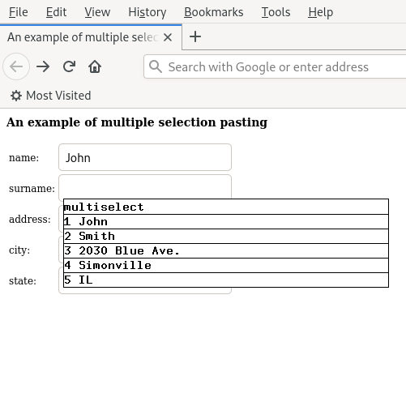

# multiselect

Select multiple strings at the same time, allowing to choose one when pasting.

- run the program passing a number of strings on the command line:
  ``multiselect 'a string' 'another' 'a third one'``
- middle click on a window to paste: the strings are shown, and pressing for
  example ``1`` the first is pasted: ``a string``

The strings can also be passed as lines of a text file on standard input:
``multiselect < file``

As an example, after running ``multiselect John Smith...`` and middle-clicking
on the second field of a web form, the state is this:

the user can click '2' to have ``Smith`` pasted.

